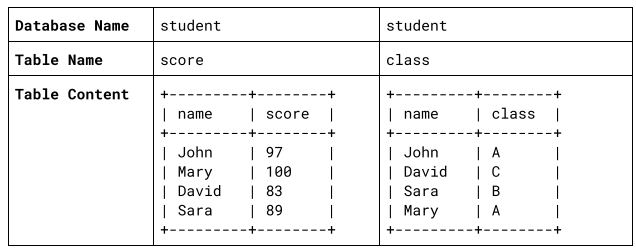

##   Q1

+ 請以任意語⾔/形式撰寫⼀段腳本，找出 words.txt 檔案內容中重複次數最多的單字(⼤⼩寫將忽略不計。舉例來說：the/The 將會被視為相同單字)
+ 範例 words.txt 檔案內容:
```
Twinkle, twinkle, little star, 
How I wonder what you are. 
Up above the world so high, 
Like a diamond in the sky. 
Twinkle, twinkle, little star, 
How I wonder what you are!
``` 
+ 預期輸出: 4 twinkle
``` 
Ans : 
tr '[:upper:]' '[:lower:]' < word.txt | tr -sc '[:alpha:]' '[\n*]'|sort |uniq -c |sort -nr | head -n 1 |awk '{print $1 $2}'

```

##  Q2

+ 請以任意語⾔/形式撰寫⼀段腳本，腳本將從 STANDARD INPUT 讀取⼀個整數數值
+ 預期輸出字串為費伯納⻄數列前 N 項，且每個數值輸出之間以「逗號」區隔
+ 範例輸入：3
+ 範例輸出：0, 1, 1
+ 範例輸入：10
+ 範例輸出：0, 1, 1, 2, 3, 5, 8, 13, 21, 34
~~~
#!/bin/bash

# 获取用户输入的斐波那契数列长度
echo "请输入斐波那契数列的长度："
read length

# 初始化斐波那契数列的前两个数
a=0
b=1

# 打印斐波那契数列
echo "斐波那契数列："
echo -n "$a "
echo -n "$b "

# 计算并打印斐波那契数列的剩余部分
i=2
while [ $i -lt $length ]
do
  # 计算下一个数
  next=$((a + b))

  # 打印下一个数
  echo -n "$next "

  # 更新前两个数的值
  a=$b
  b=$next

  # 增加索引计数器
  i=$((i + 1))
done

echo
~~~


## Q3
- 請使⽤任意 Infra-as-Code ⼯具設計能運⾏於 AWS 雲平台之⾼可⽤性 Load Balancer 
- 架構設計，並於 Load Balancer 後端接上任⼀形式呈現之網⾴伺服器，同時須附上適當的註解或說明檔盡可能詳細地說明你/妳的設計思維
- 必要元件
  - Load Balancer
  - Web Server
- 預期結果
  - 適當的引導⽂件以輔助⾯試官了解你的思路
  - 瀏覽器開啟 Load Balancer 位置能取得網⾴回應內容
  - 畫⾯輸出將由後端隨機抓取之網⾴伺服器提供⽂字內容
  - 輸出畫⾯內容之指定⽂字為「Hello  {hostname}  」其中  {hostname}  為主機名稱

## Q4
- 試想有⼀資料庫，⽤來紀錄學⽣成績與班級資訊，內容如下



- 請寫出找出分數排名第⼆名學⽣所在的班級的 SQL 描述句

## Q5(加分題)
- 請用任何容器技術，運行 Nginx, PHP, MySQL 等服務
- PHP 方面，請使用 Laravel 建構一個隨意但具有資料庫 CRUD 的服務網站
- 資料庫方面，請參考 [testdb](https://github.com/datacharmer/test_db)，並可成功依照說明成功匯入資料庫，與測試資料庫
- 請撰寫腳本並備份您的資料庫系統


---
情境實戰測驗
## Q1
試想臨時有⼀活動網⾴專案將於近⽇推出，預期推廣期間訪客流量會是平⽇常態之百倍（或更多）請簡易描述你/妳將如何確保服務能在推廣期間正常運作？考量的細節是什麼？

## Q2
試想有⼀個 API 伺服器集群，背後由多台機器組成，此時服務監控系統發現其中⼀台回應時間經常逾時，僅有此機器異常，請簡易描述你/妳將會如何進⾏問題排查？考量的細節是什麼？

## Q3
試想有⼀項⽬運⾏於 AWS EC2 機器之上，已確認該服務仍然正常運⾏中
但由於不明原因導致無法再次透過 SSH 登入確認狀態（已確認排除並非網路異常，亦非防火牆阻擋所導致）。
請簡易描述你/妳將如何排查問題，並且讓服務恢復正常運作？考量的細節是什麼？如果可以，請試著回答造成無法登入的可能的肇因為何？

## Q4
試想已有⼀組 ELK/EFK ⽇誌服務集群，⽽今⽇有⼀新服務上線並且串接⽇誌紀錄，讓開發者能夠透過 Kibana 進⾏線上錯誤排查，你/妳會如何將⽇誌檔內容串接⾄ ELK/EFK 系統？考量的細節是什麼？

---